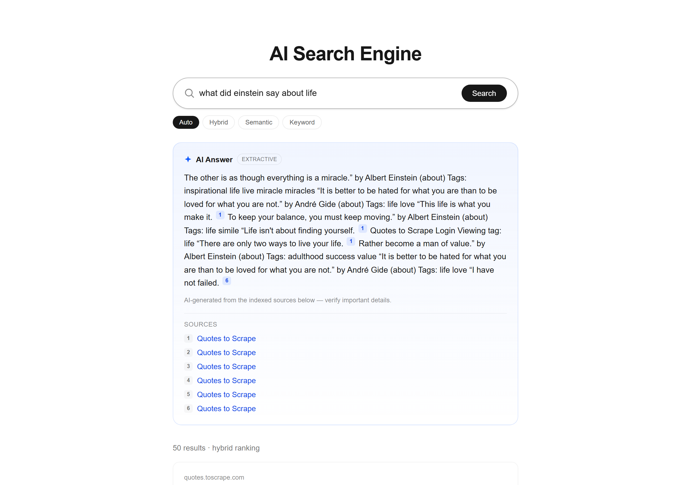
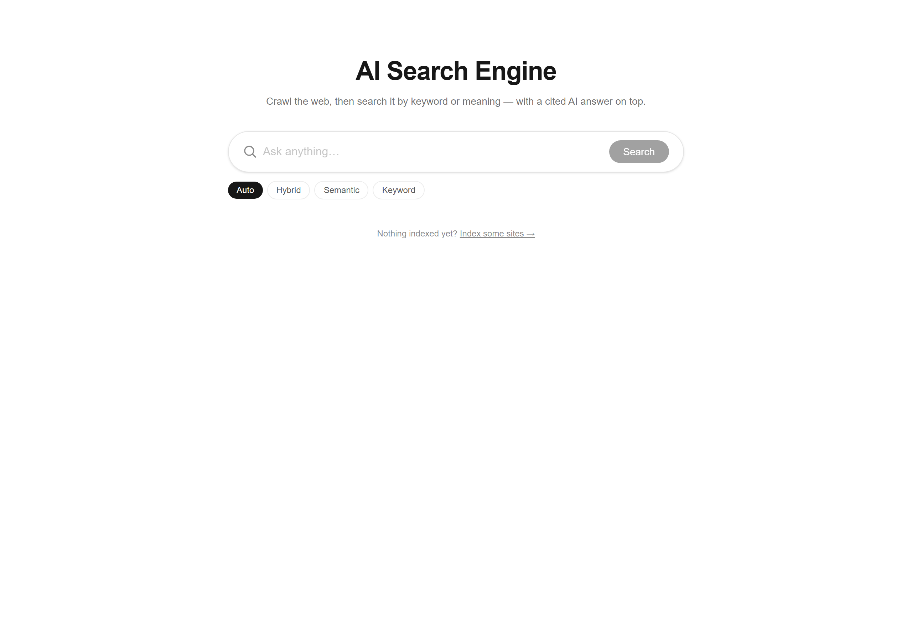
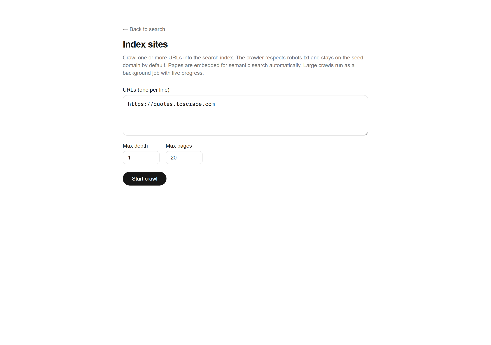
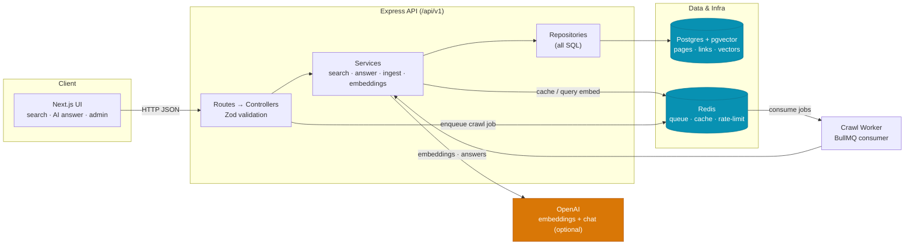
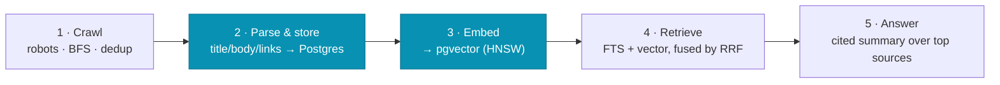

<div align="center">

# 🔎 AI Search Engine

**A from-scratch, full-stack search engine that crawls the web, indexes pages in Postgres, and answers questions with a cited, Perplexity-style AI answer on top.**

Not an API wrapper — a real crawler, a real inverted index, real vector search, and hybrid ranking fused in a single SQL query.

[](https://ai-search-engine-utkarshs-projects-621a47b8.vercel.app)
&nbsp;
[](./docs/ARCHITECTURE.md)


</div>

---

## 🚀 Live demo

| | URL |
| --- | --- |
| **Web app** | **https://ai-search-engine-utkarshs-projects-621a47b8.vercel.app** |
| **API** | https://ai-search-engine-api-tz9f.onrender.com/api/v1/health |

> The demo runs in **fully offline AI mode** — hashing-trick embeddings for semantic search and an extractive (non-LLM) answer generator — so it works with **zero API keys**. Add an `OPENAI_API_KEY` to switch on OpenAI embeddings + LLM answers. The corpus is pre-seeded with ~110 crawled pages.
>
> The API is on a free tier that sleeps after ~15 min idle — the first request may take ~50s to wake it, then it's instant.

---

## 📸 Screenshots

<div align="center">

**Search + cited AI answer**



<table>
<tr>
<td width="50%"><b>Home</b><br/></td>
<td width="50%"><b>Admin — crawl a site</b><br/></td>
</tr>
</table>

</div>

---

## ✨ Features

**Search**
- 🔤 **Keyword** — Postgres full-text search (`tsvector` / `ts_rank_cd`), stemmed & weighted (title > description > body)
- 🧠 **Semantic** — vector embeddings + **pgvector** cosine KNN over an **HNSW** index
- ⚡ **Hybrid** — keyword and vector rankings fused with **Reciprocal Rank Fusion**, in **one SQL query**
- 🩹 **Fuzzy** — `pg_trgm` `word_similarity` for typo tolerance
- 🎯 **Auto mode** — picks the best strategy per query; plus `<mark>` snippet highlighting, autocomplete & pagination

**AI answer (RAG)**
- 💬 A concise answer with **inline `[n]` citations** synthesized from the top retrieved pages
- 🔌 OpenAI chat when a key is present, else a **non-LLM extractive** summary — the endpoint always works

**Crawler & indexing**
- 🕷️ A polite, real web crawler: **robots.txt**, per-host delays, BFS by depth, URL dedup/normalization, retries
- 🧩 Parses title / description / body / link graph (cheerio) and **embeds** pages into pgvector

**Scale & resilience** *(all degrade gracefully with no Redis / no API key)*
- 📦 **Async crawl queue** (BullMQ) with live progress polling — scale with `--scale worker=3`
- 🧷 **Response caching** with automatic index-version invalidation on new crawls
- 🚦 **Distributed rate limiting** (Redis-backed, falls back to in-memory)
- 🛡️ Retry-with-backoff on external calls; every optional dependency has a clean fallback

---

## 🏗️ Architecture



**Strict one-way dependency** inside the API: `routes → controllers → services → repositories → db`. All SQL lives in `repositories/`; services never touch `pg`. The crawl worker reuses the **exact same services** — the queue changes *when* work runs, not *how*.

📖 **[Full architecture doc →](./docs/ARCHITECTURE.md)** — query flow, RAG flow, crawl pipeline, ER diagram, middleware order, and the resilience matrix, all as diagrams.

---

## 🔬 How it works



1. **Crawl** — a polite crawler fetches and parses pages, storing text + the link graph in Postgres.
2. **Index** — each page gets a generated `tsvector` (keyword) and a vector `embedding` (semantic), indexed with **GIN** and **HNSW**.
3. **Retrieve** — full-text and vector search run together; results are fused with **Reciprocal Rank Fusion**, with a fuzzy fallback for typos.
4. **Answer** — the top sources are summarized into a concise, **cited** answer (LLM when a key is set, extractive otherwise).

### Why Reciprocal Rank Fusion?

Keyword and semantic search each return a ranked list. RRF combines them using only positions — no score calibration needed:

```
score(doc) = Σ  1 / (k + rank_in_list)      # k = 60
```

A doc ranked #1 by keyword *and* #2 by vectors beats one that's #1 in only a single list. It runs in **one SQL query** (`PageRepository.searchHybrid`): two CTEs rank the corpus (`ts_rank_cd` and `embedding <=>`), a third sums the RRF contributions, and the outer query joins back for snippets and an accurate total.

---

## 🧰 Tech stack

| Layer | Technology |
| --- | --- |
| **Frontend** | Next.js 16 (App Router) · React 19 · TypeScript · Tailwind CSS v4 |
| **Backend** | Node.js · Express · TypeScript (ESM) · layered architecture |
| **Database** | Postgres 16 · **pgvector** (HNSW) · `pg_trgm` · full-text search |
| **Search** | Postgres FTS · vector KNN · Reciprocal Rank Fusion (in SQL) |
| **Embeddings** | OpenAI · local (Xenova MiniLM) · offline hash · none — pluggable |
| **AI answers** | OpenAI chat + non-LLM extractive fallback (RAG) |
| **Infra** | Redis · BullMQ (queue) · Docker Compose · GitHub Actions CI |
| **Deploy** | Vercel (frontend) · Render (backend) · Neon (Postgres + pgvector) |

---

## 📡 API reference

Base path `/api/v1`. All responses use the envelope `{ success, data }` / `{ success, error }`.

| Method | Path | Description |
| --- | --- | --- |
| `GET` | `/health` | Liveness + DB / Redis / queue / AI status |
| `GET` | `/search?q=&mode=&page=&limit=` | Search — `mode` = `auto` \| `hybrid` \| `semantic` \| `fulltext` \| `fuzzy` |
| `GET` | `/answer?q=&mode=&maxSources=` | Retrieve top pages → synthesize a **cited** AI answer |
| `GET` | `/suggest?q=` | Autocomplete over indexed titles |
| `POST` | `/crawl` | Crawl → parse → embed → store. `202 + jobId` (queue on) or a sync report |
| `GET` | `/crawl/:jobId` | Async crawl job status / progress / result |

<details>
<summary><b>Example — search</b></summary>

```bash
curl "https://ai-search-engine-api-tz9f.onrender.com/api/v1/search?q=einstein%20life&mode=hybrid&limit=3"
```
```jsonc
{
  "success": true,
  "data": {
    "query": "einstein life", "mode": "hybrid", "total": 50, "page": 1, "limit": 3,
    "results": [
      { "id": 1, "title": "Quotes to Scrape", "url": "https://quotes.toscrape.com/tag/life/",
        "snippet": "…<mark>life</mark> is what happens…", "score": 0.032, "matchType": "hybrid" }
    ]
  }
}
```
</details>

<details>
<summary><b>Example — crawl</b></summary>

```bash
curl -X POST "…/api/v1/crawl" -H "Content-Type: application/json" \
  -d '{ "urls": "https://quotes.toscrape.com", "maxPages": 30, "maxDepth": 3 }'
```
</details>

---

## ⚡ Quick start

### Option A — Docker (the whole stack)

```bash
docker compose up --build
# frontend → http://localhost:3000    backend → http://localhost:5000/api/v1
```

Runs out of the box with offline `hash` embeddings + extractive answers (**no API key needed**). To enable OpenAI, drop a `.env` next to `docker-compose.yml`:

```env
OPENAI_API_KEY=sk-...
EMBEDDING_PROVIDER=openai
EMBEDDING_DIM=1536
LLM_PROVIDER=openai
```

### Option B — Local dev

```bash
npm install && npm run install:all       # root + backend + frontend deps

# 1) Database (pgvector)
cd backend && docker compose up -d        # Postgres on :5432
cp .env.example .env
npm run db:migrate

# 2) Run both apps (from repo root)
cd .. && npm run dev
```

Then open the app → **Index sites** (`/admin`) → crawl e.g. `https://quotes.toscrape.com` → search.

---

## 📁 Project structure

```
ai_search_engine/
├── backend/                 # Express REST API (TypeScript, ESM)
│   ├── src/
│   │   ├── routes/          #  HTTP routes  →  controllers  (Zod validation)
│   │   ├── controllers/     #  thin request handlers
│   │   ├── services/        #  search · answer · ingest · embeddings · crawler
│   │   ├── repositories/    #  ALL SQL lives here (pages, links)
│   │   ├── queue/           #  BullMQ crawl queue + worker
│   │   └── db/              #  pool + migration runner
│   └── migrations/          #  001 pages+FTS+pg_trgm · 002 pgvector+HNSW
├── frontend/                # Next.js 16 UI (search, answer box, admin)
├── docs/                    # ARCHITECTURE.md · diagrams · screenshots
├── docker-compose.yml       # Postgres + Redis + backend + worker + frontend
└── .github/workflows/       # CI (typecheck · lint · test · build · migrate)
```

---

## 📚 Documentation

- **[docs/ARCHITECTURE.md](./docs/ARCHITECTURE.md)** — the deep dive: system, query, RAG, crawl, and data-model diagrams; resilience matrix; key-file map.
- **[docs/architecture.html](./docs/architecture.html)** — interactive, themed version of the diagrams.
- **[backend/README.md](./backend/README.md)** — backend guide & conventions.

---

<div align="center">
<sub>Built by <a href="https://github.com/UtkarshBirla28">Utkarsh Birla</a> · full-stack search from crawler to cited answer.</sub>
</div>
