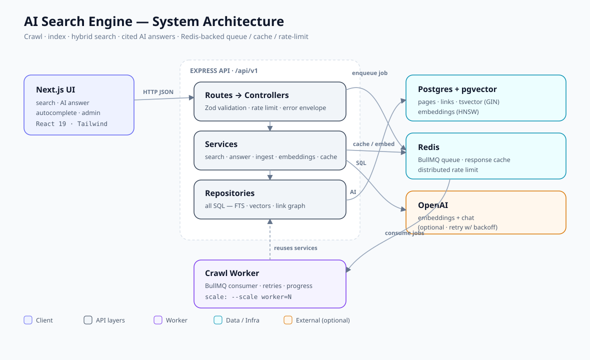
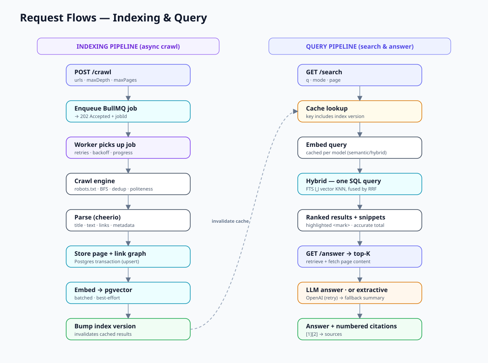
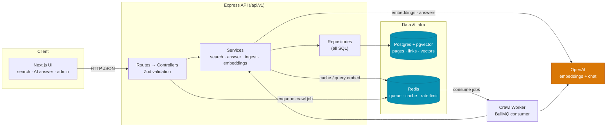
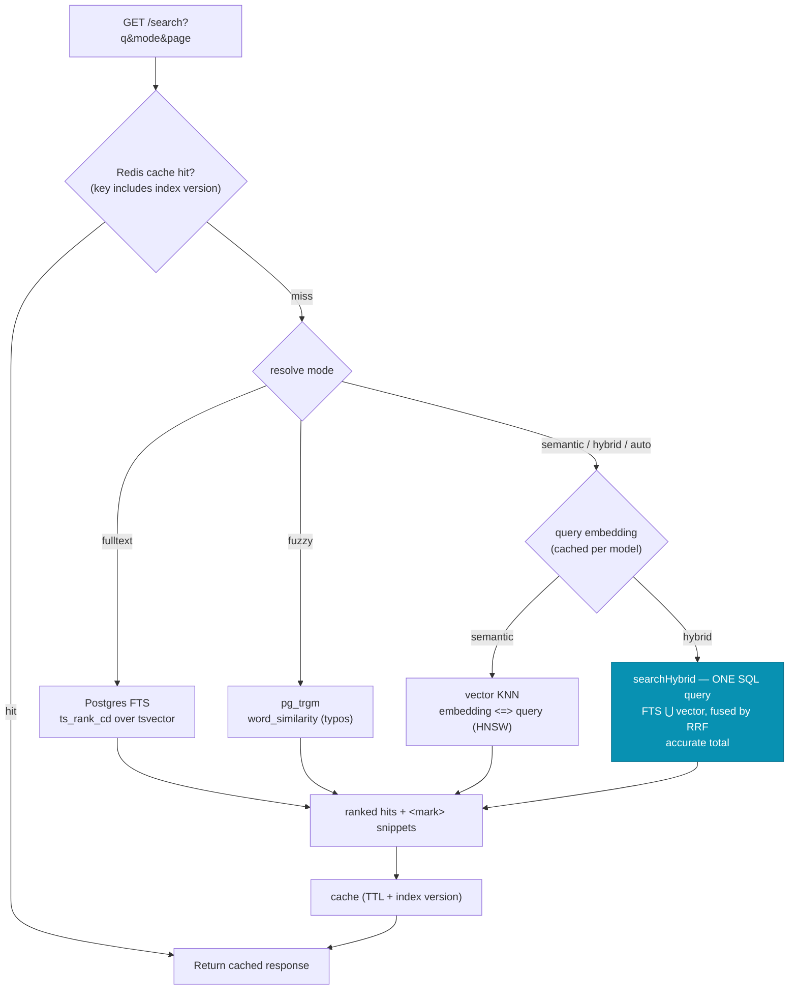
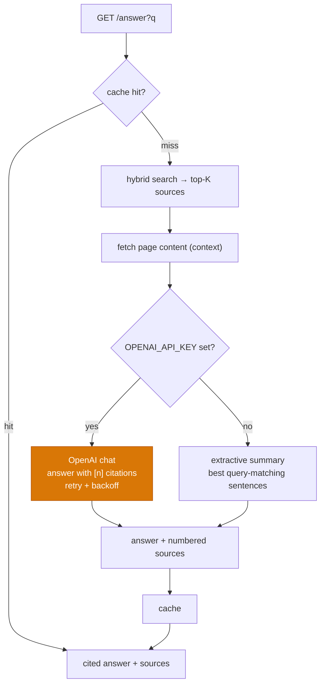
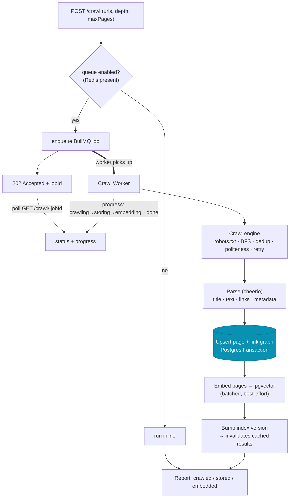
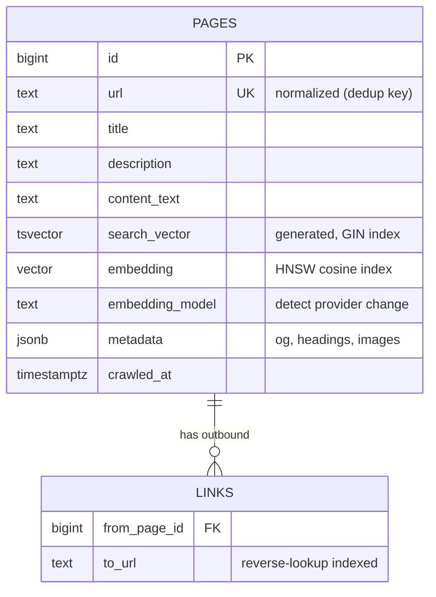
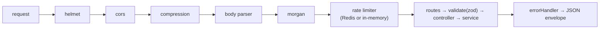

# AI Search Engine — Architecture & Documentation

A from-scratch, full-stack AI search engine: it **crawls** the web, **indexes** pages
in Postgres, **searches** them with hybrid keyword + semantic ranking, and answers
questions with a **cited AI answer**. Redis adds an async job queue, caching, and
distributed rate limiting. Everything degrades gracefully when optional
dependencies (Redis, an LLM key) are absent.

- **Frontend:** Next.js 16 (App Router) · React 19 · Tailwind v4
- **Backend:** Node · Express · TypeScript (ESM) · layered architecture
- **Data:** Postgres 16 + **pgvector** (FTS + vectors + link graph)
- **Infra:** Redis (BullMQ queue · cache · rate limit) · OpenAI (embeddings + chat)

> 🚀 **Live demo:** [web app](https://ai-search-engine-utkarshs-projects-621a47b8.vercel.app) · [API health](https://ai-search-engine-api-tz9f.onrender.com/api/v1/health) — deployed on Vercel + Render + Neon. See the [README](../README.md) for quick start.

> 📊 **Visual version:** open [`architecture.html`](./architecture.html) in a browser for
> interactive, themed diagrams. Image exports live in [`diagrams/`](./diagrams/).





---

## 1. System architecture



**One direction of dependency** inside the API: `routes → controllers → services →
repositories → db`. All SQL lives in `repositories/` + `db/`; services never touch
`pg`. The worker reuses the exact same services as the API — the queue only changes
*when* work runs, not *how*.

---

## 2. Search & answer request flow

Search resolves `mode` (`auto` picks hybrid when embeddings are on), checks the
cache, and fuses keyword + vector ranking in a single SQL query.



### AI answer (RAG)



---

## 3. Async crawl & indexing pipeline

`POST /crawl` enqueues a job and returns immediately; a worker crawls, parses,
stores, and embeds — reporting live progress. Falls back to a synchronous crawl
when the queue is disabled.



Scale by running more workers: `docker compose up --scale worker=3`. Each worker is
stateless and pulls from the shared Redis queue.

---

## 4. Data model



- **`search_vector`** is a *generated* column: Postgres tokenizes, removes
  stopwords, and stems (snowball) with weights title(A) > description(B) > body(C).
  We deliberately don't hand-roll a tokenizer/stemmer — the DB does it, indexed.
- **`embedding`** is a pgvector column (dimension = the active provider's). HNSW
  index enables fast approximate nearest-neighbour by cosine distance.
- **`links`** stores the outbound link graph (basis for future authority ranking).

---

## 5. How hybrid ranking works (RRF)

Keyword and semantic search each return a *ranked list*. **Reciprocal Rank Fusion**
combines them using only positions — no score calibration needed:

```
score(doc) = Σ  1 / (k + rank_in_list)      # k = 60
```

A document ranked #1 by keyword *and* #2 by vectors beats one that's #1 in only a
single list. This runs in **one SQL query** (`PageRepository.searchHybrid`): two
CTEs (`ts_rank_cd` and `embedding <=>`) rank the corpus, a third groups and sums the
RRF contributions, and the outer query joins back for snippets and an accurate total.

---

## 6. Request lifecycle (middleware order)



All responses use one envelope: `{ success: true, data }` or
`{ success: false, error: { message } }`.

---

## 7. Resilience & graceful degradation

| Optional dependency | Present | Absent (fallback) |
| --- | --- | --- |
| **Redis** | async queue, caching, distributed rate limit | sync crawl, no cache, in-memory rate limit |
| **OpenAI key** | LLM answers, OpenAI embeddings | extractive answers, local/hash embeddings |
| **Embeddings (`none`)** | semantic + hybrid search | keyword + fuzzy only |
| **Database** | crawl + search | server boots; `/health` reports `not-configured` |

Other resilience measures: retry-with-backoff on all OpenAI calls; BullMQ job
retries with exponential backoff; crawler retries transient HTTP with backoff;
embedding failures never fail a crawl (pages stay searchable lexically, backfill
later with `npm run embed`); DB pool errors are isolated; graceful shutdown drains
the worker, queue, pool, and Redis.

---

## 8. Tech stack & key files

| Concern | Choice | Where |
| --- | --- | --- |
| API | Express + TS (ESM) | `backend/src/app.ts`, `routes/` |
| Crawler | fetch + cheerio + p-limit + robots-parser | `services/crawler/` |
| Keyword search | Postgres FTS (`tsvector`/`ts_rank_cd`) | `repositories/page.repository.ts` |
| Fuzzy | `pg_trgm` `word_similarity` | `repositories/page.repository.ts` |
| Semantic | pgvector + HNSW | migration `002`, `searchSemantic` |
| Embeddings | OpenAI / local / hash / none | `services/embeddings/` |
| Hybrid | RRF in SQL | `searchHybrid`, `services/search.service.ts` |
| AI answer | OpenAI chat + extractive fallback | `services/answer.service.ts` |
| Queue | BullMQ + Redis | `queue/`, `worker.ts` |
| Cache | Redis, index-version invalidation | `services/cache.ts` |
| Rate limit | express-rate-limit (+ Redis store) | `middlewares/rateLimiter.ts` |
| Frontend | Next.js 16 + Tailwind v4 | `frontend/src/` |

---

## 9. API reference

| Method | Path | Description |
| --- | --- | --- |
| GET | `/api/v1/health` | Liveness + DB/Redis/queue/AI status |
| GET | `/api/v1/search?q&mode&page&limit` | `mode` = auto\|hybrid\|semantic\|fulltext\|fuzzy |
| GET | `/api/v1/answer?q&mode&maxSources` | Cited AI answer (RAG) |
| GET | `/api/v1/suggest?q&limit` | Title autocomplete |
| POST | `/api/v1/crawl` | Crawl → embed → store (202 + jobId, or sync report) |
| GET | `/api/v1/crawl/:jobId` | Async job status / progress / result |

See [`../README.md`](../README.md) for quick start and [`../backend/CLAUDE.md`](../backend/CLAUDE.md)
for backend conventions.
